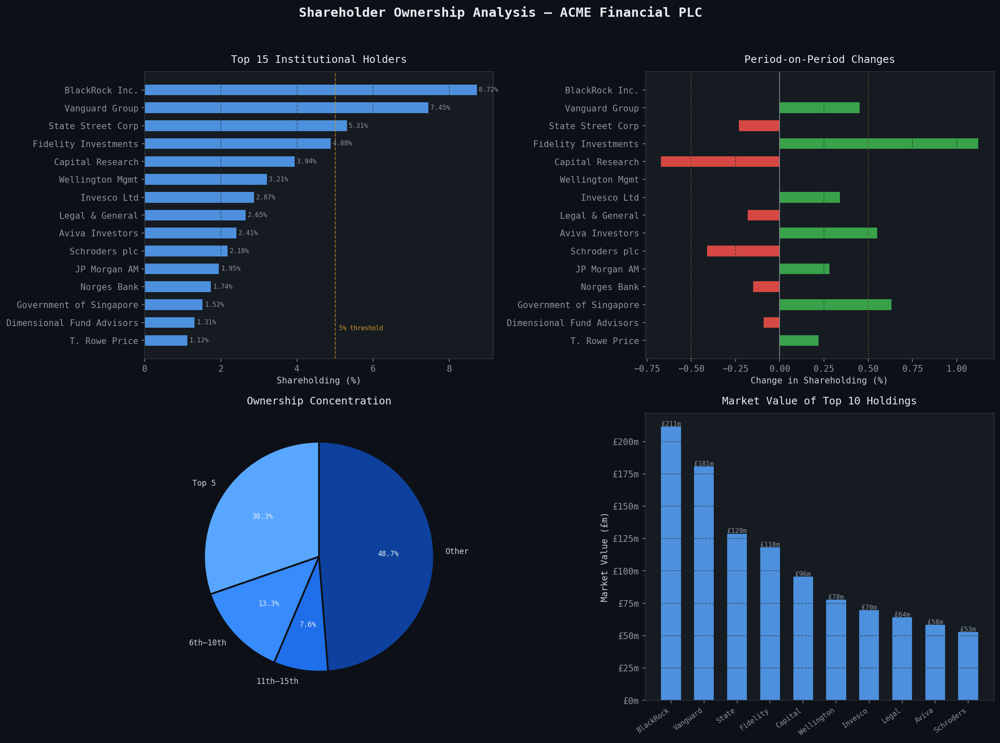

Shareholder-analysis
A Python tool that analyses institutional shareholding data to identify ownership concentration, flag unusual position changes, and visualise trends across a company register — mirroring real-world workflows in financial services.
 Overview

Institutional ownership data is at the core of corporate governance and investor relations. This project simulates a real shareholder register analysis pipeline: ingesting holdings data, computing concentration metrics, flagging significant position changes, and producing a professional multi-panel dashboard.

---

## 🔍 What It Does

- Analyses the top 15 institutional holders of a listed company
- Calculates **ownership concentration** using the Herfindahl-Hirschman Index (HHI)
- Computes **Top 5 / Top 10 concentration ratios**
- Flags institutions with position changes ≥ ±0.5% (period-on-period)
- Calculates **market value** of each holding at current share price
- Produces a 4-panel visualisation:
  - Top 15 holders bar chart
  - Period-on-period shareholding changes (with flag threshold lines)
  - Ownership concentration pie chart
  - Market value of top 10 holdings

---

## 📈 Sample Output



---

## 🛠 Tech Stack

| Library | Purpose |
|---------|---------|
| `pandas` | Data manipulation and register management |
| `numpy` | Numerical computation and simulated data |
| `matplotlib` | Multi-panel chart generation |
| `seaborn` | Styling and colour palettes |

---

## 🚀 How to Run

```bash
# 1. Clone the repo
git clone https://github.com/mehersunkara/shareholder-analysis.git
cd shareholder-analysis

# 2. Install dependencies
pip install pandas numpy matplotlib seaborn

# 3. Run the analysis
python project1_shareholder_analysis.py
```

Output will be printed to the terminal and a chart saved as `shareholder_analysis_output.png`.

---

## 📁 Project Structure

```
shareholder-analysis/
│
├── project1_shareholder_analysis.py   # Main analysis script
├── shareholder_analysis_output.png    # Sample output chart
└── README.md
```

---

## 💡 Key Concepts Demonstrated

- **HHI (Herfindahl-Hirschman Index):** A standard measure of market/ownership concentration used in finance and economics. Higher scores indicate greater concentration.
- **Concentration ratios:** Top-N ownership thresholds commonly used in governance reporting.
- **Flagging logic:** Threshold-based alerting for significant position changes — standard in institutional analytics workflows.
- **Market value calculation:** Translating share counts into sterling value for client reporting.

---

## 🔮 Possible Extensions

- Load real data from Companies House (UK) or SEC EDGAR (US)
- Add time-series tracking across multiple reporting periods
- Automate PDF report generation
- Add s793 response parsing logic

---

## 👤 Author

**Meher Sunkara** — Shareholder Analyst | Financial Data | Python · R · SQL  
[LinkedIn](https://linkedin.com/in/mehersunkara)
